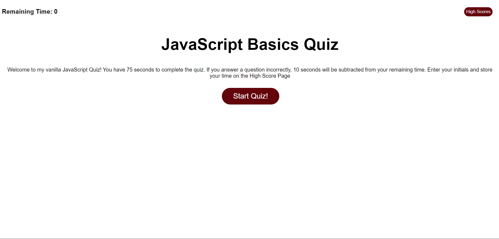
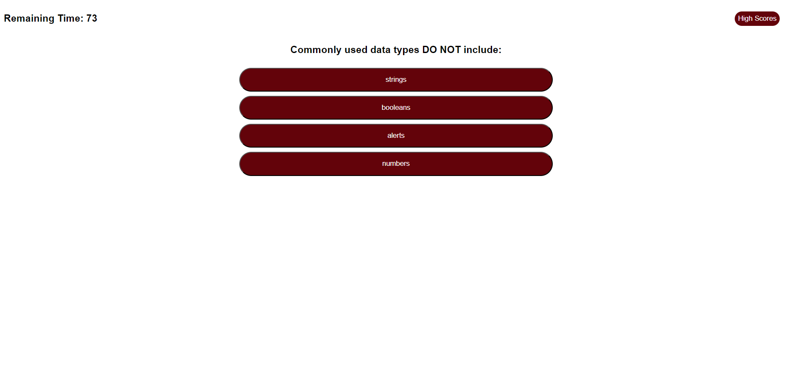
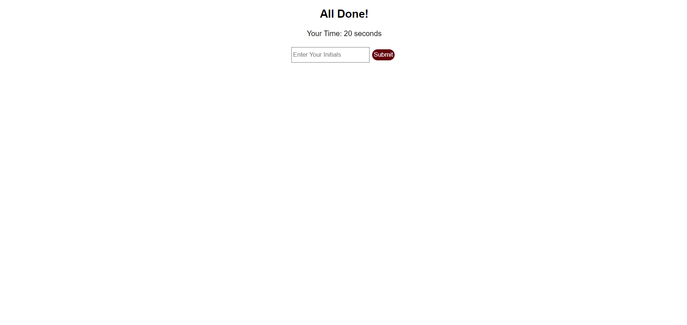
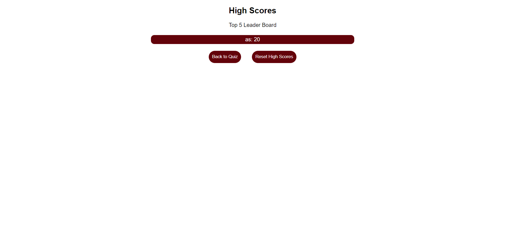

# Code-Quiz
JavaScript Quiz with timer, questions, and leaderboard
# Decription
The JavaScript quiz that has 5 multiple choice questions. This quiz consist of 5 multiple choice with a limit of 75 seconds to answer the questions. To keep the score and have them be in a leaderboard.
# Screenshots

# Link
[Click to View Link](https://rojas259.github.io/Code-Quiz/)